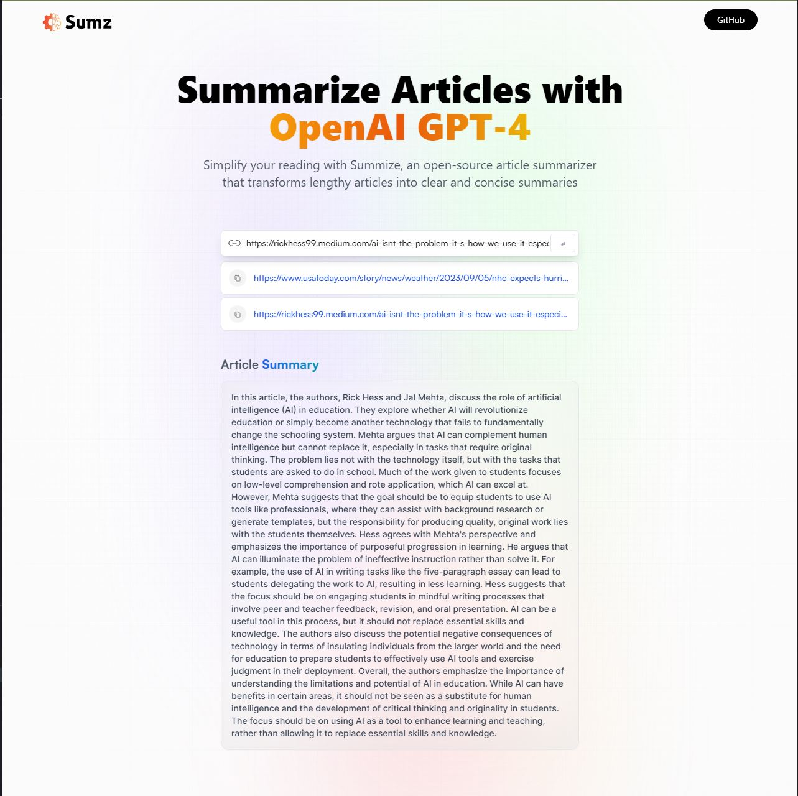

# React + Vite + Rapid API

Here is an article summarizer with a modern user interface connection to open AI's GPT model and the integration of Redux toolkit query functionalities like copy to clipboard browser history storage.
You take the URL of a lengthy article paste it here and the AI will quickly provide a summary it's as simple as that.

